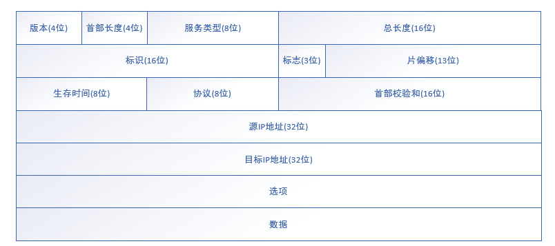
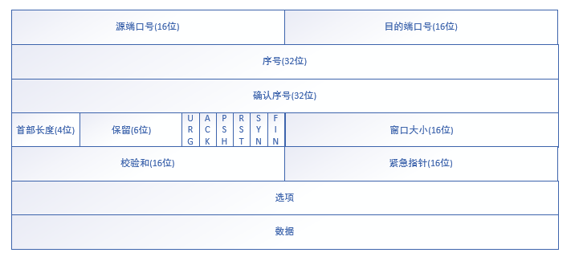
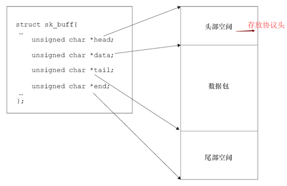
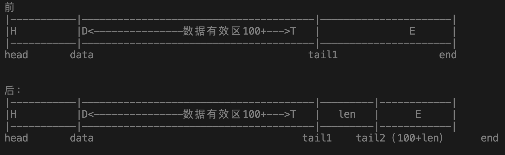
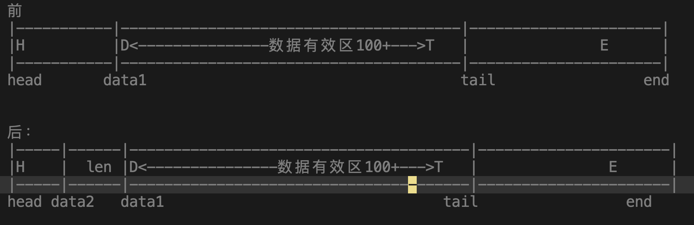

### 网络OSI模型：


- 物理层:在设备之间传输比特流，规定了电平、速度和电缆针脚。
- 数据链路层：将比特组合成字节，再将字节组合成帧，使用链路层地址（以太网使用MAC地址）来访问介质，并进行差错检测。
- 网络层：提供逻辑地址，供路由器确定路径。
- 传输层：提供面向连接或非面向连接的数据传递以及进行重传前的差错检测。
- 会话层：负责建立、管理和终止表示层实体之间的通信会话。该层的通信由不同设备中的应用程序之间的服务请求和响应组成。
- 表示层：提供各种用于应用层数据的编码和转换功能，确保一个系统的应用层发送的数据能被另一个系统的应用层识别。
- 应用层：OSI参考模型中最靠近用户的一层，为应用程序提供网络服务。


### TCP/IP四层模型


### 三 以太网帧 


目的 MAC 地址：6 个字节，指明帧的接收者。

源 MAC 地址：6 个字节，指明帧的发送者。

类型：2 个字节，指明帧中数据的协议类型，比如常见的 IPv4 中的 ip 协议采用 0x0800。

数据与填充：46~1500 个字节，包含了上层协议传递下来的数据，如果加入数据字段后帧长度不够 64 字节，会在数据字段加入填充字段达到 64 字节。

校验和：4 个字节，对接收网卡(主要是检测数据与填充字段)提供判断是否传输错误的一种方法，如果发现错误，则丢弃此帧。目前最为流行的用于校验和(FCS)的算法是循环冗余校验(cyclic redundancy check -- CRC)。


### 四 IP帧

IP 协议是 TCP/IP 协议族中最为核心的协议，它提供不可靠的、无连接的服务，也即依赖其他层的协议进行差错控制。在局域网中，IP 协议往往被封装在以太网帧中传送，而所有的 TCP、UDP、ICMP、IGMP 数据都被封装在 IP 数据报中传送。



```
/*IP 头定义，共 20 个字节*/
typedef struct _IP_HEADER
{
    char m_cVersionAndHeaderLen;    //前4位：版本信息；后4位：头长度
    char m_cTypeOfService;          //服务类型 8 位
    short m_sTotalLenOfPacket;      //数据包长度
    short m_sPacketID;              //数据包标识
    short m_sSliceinfo;             //分片使用
    char m_cTTL;                    //存活时间
    char m_cTypeOfProtocol;         //协议类型
    short m_sCheckSum;              //校验和
    unsigned int m_uiSourIp;        //源IP
    unsigned int m_uiDestIp;        //目的IP
}__attribute__((packed))IP_HEADER,*PIP_HEADER;
```

版本：4 位，用来表明 IP 协议实现的版本号，当前一般为 IPv4，即 0100，IPv6 的为 0110，这个字段确保可能运行不同 IP 版本的设备之间的兼容性。

首部长度：即报头长度，4 位，以 32 bit 的字来定义 IP 首部的长度，包括可选项。若该字段的最小值是 5 (标准头部长度)，即 5*32=160 比特 =20 字节，此字段最大值为15 (有扩展部分)，即15*32 =480 比特 = 60 字节。

服务类型：8位，用于携带提供服务质量特征信息的字段，服务类型字段声明了数据报被网络系统传输时可以被怎样处理。其中前 3 比特位优先权子字段(Precedence，现已被忽略，各种终端都不采用)。第 8 比特保留未用。第 4 至第 7 比特分别代表延迟、吞吐量、可靠性和花费，当它们取值为 1 时分别代表要求最小时延、最大吞吐量、最高可靠性和最小花费，这 4 比特的服务类型中只能置其中 1 比特为 1，可以全为 0 ，若全为 0 则表示一般服务，大多数情况下该服务类型会被忽略。

总长度：16 位，指明整个数据报的长度，按字节计算，最大长度为 2^16 字节。

标识：16 位，用来唯一标识主机发送的每一份数据报，IP 软件会在存储器中维持一个计数器，每产生一个数据段，计数器就加 1，并将此值赋给标志字段。但这个“标识”并不是序号，因为 IP 是无连接服务，数据报不存在按序接收问题，如数据报由于超过网络的 MTU (最大传送单元) 而必须分片时，这个标志字段的值就会被复制到所有的数据报的标识字段中，相同的标识字段的值使分片后各数据报片能正确的重装成为原来的数据报。

标志：3 位，分别是 RF、DF、 MF，目前只有 DF，MF 有效，DF(don't fragment)，置为 0 时表示可以分段，置为 1 时是不能被分段，MF(more fragment)，置为 0 时表示该数据段为最后一个数据段，置为 1 时表示后面还有被分割分段。

段偏移量：13 位，指出较长的分组在分段后，某段在原分组的相对位置。也就是说相对用户字段的起点，该片从何处开始。段偏移以 8 个字节(有 3 位被 flags 占据)为偏移单位，这就是每个分片的长度一定是 8 字节 (64位) 的整数倍。

生存期：8 位，用来设置数据报最多可以经过的路由器数，由发送数据的源主机设置，通常为 32、64、128等，每经过一个路由器，其值减 1 ，直到 0 该数据报被丢弃。

协议：8 位，指明 ip 数据字段中的数据采用上层什么协议封装的，常见的有 ICMP(1)、IGMP(2)、TCP(6)、UDP(17)

首部校验和：16位，填充根据 ip 头部计算得到的校验和码。计算方法是：对头部中每个 16 比特进行二进制反码求和，但不含涉及头部后的数据字段。

源 IP 地址：源 ip 地址，32 位。

目的 IP 地址：目标 ip 地址，32 位。

选项：n*32 位，用来定义一些可选项：如记录路径、时间戳等，但这些选项很少被使用，同时并不是所有主机和路由器都支持这些选项。可选字段的长度必须是 32 比特的整数倍，如果不足，必须填充 0 以达到此长度要求，根据 IHL(首部长度) 可以得到选项的长度。

数据：不定长度，但受限于数据报的最大长度 2^16 ，这是在数据报中要传输的数据，它是一个完整的较高层报文或报文的一个分片。


### 五 UDP 帧

UDP(User Datagram Protocol) 即用户数据报协议，在网络中它与 TCP 协议一样用于处理数据包，是一种不可靠(服务不用确认、不对报文排序、不进行流量控制，可能会出现丢失、重复、失序现象)、无连接(在主机间不建立会话)的协议，在 OSI 模型中的第四层--传输层，处于 IP 协议的上一层。由于 UDP 传输不是可靠性服务，所以帧结构较为简单，而且处理与发送速率高，开销要求低，支持点对点和一点对多点的通信，经常用作音频、视频和普通数据的传输协议，因为它们即使偶尔丢失一两个数据包，也不会对接收结果产生太大影响。


```
/*UDP 头定义，共 8 个字节*/
typedef struct_UDP_HEADER
{
    unsigned short m_usSourPort;     //源端口号 16 bit
    unsigned short m_usDestPort;     //目的端口号 16 bit
    unsigned short m_usLength;      //数据包长度 16 bit
    unsigned short m_usCheckSum;    //校验和 16 bit
}__attribute__((packed))UDP_HEADER,*PUDP_HEADER;
```

源端口：16 bit (2 个字节)，是一个大于 1023 的 16 位数字，由基于 UDP 应用程序的用户进程随机选择。

目的端口：16 bit (2 个字节)，指明接收者所用的端口号，一般由应用程序来指定。

数据长度：16 bit (2 个字节)，标明 UDP 头部和 UDP 数据的总字节长度。

校验和字段：16 bit (2 个字节)，用来对 UDP 头部和 UDP 数据进行校验。与 TCP 不同的是，此字段是可选项，而 TCP 数据段中必须包含校验和字段。

数据：不定长度，为上层协议封装好的数据。


### 六 TCP 帧

TCP(Transmission Control Protocol) 即传输控制协议，是一种面向连接的(需通过三次握手来建立 TCP 连接，在主机间建立会话)、可靠的(TCP 通过确认和按顺序传递来确保数据的传递)、基于字节流的传输层通信协议，但 TCP 传输比较慢，开销略高，并且只支持点对点通信。当应用层向 TCP 层发送用于网间传输的 8 字节表示的数据流，TCP 则把数据流分割成适当长度的报文段，最大传输段大小(MSS)通常受该计算机连接的网络的数据链路层的最大传送单元(MTU)限制，之后 TCP 把数据包传给 IP 层，由它来通过网络将包传送给接收端实体的 TCP 层。



```
/*TCP 头定义，共 20 个字节*/
typedef struct_TCP_HEADER
{
    short m_sSourPort;                  //源端口号 16 bit
    short m_sDestPort;                  //目的端口号 16 bit
    unsigned int m_uiSeqNum;            //序列号 32 bit
    unsigned int m_uiAcknowledgeNum;    //确认号 32 bit
    short m_sHeaderLenAndFlag;          //前4位：TCP 头长度；中6位：保留；后6位：标志位
    short m_sWindowSize;                //窗口大小 16 bit
    short m_sCheckSum;                  //校验和 16 bit
    short m_surgentPointer;             //紧急数据偏移量 16 bit
}__attribute__((packed))TCP_HEADER,*PTCP_HEADER;
```

 源端口：2 个字节，是一个大于 1023 的 16 位数字，由基于 TCP 应用程序的用户进程随机选择。

目的端口：2 个字节，指明接收者所用的端口号，一般由应用程序来指定。

顺序号：4 个字节，用来标识从 TCP 源端向 TCP 目的端发送的数据字节流，它表示在这个报文段中的第一个数据字节的顺序号。如果将字节流看作在两个应用程序间的单向流动，则 TCP 用顺序号对每个字节进行计数，序号是 32 bit 的无符号数，序号达到 2^32-1 后又从 0 开始。比如我们收到一个数据报中 sq(顺序号) =0，数据报内容为 20 字节，那么下一个数据报的 sq 就应该是 21。当建立一个新的连接时，SYN 标志变为 1，顺序号字段包含由这个主机选择的该连接的初始顺序号 ISN。

确认序号：4 个字节，包含发送确认的一端所期待收到的下一个顺序号。因此，确认序号应该是上次已经成功收到数据字节顺序号加 1 。比如我们收到的一个数据报的 sq = 0 ，数据报内容为 20 字节，那么我们的 ack(确认序号) 应该是 21 ，用来表明 sq=0 ，内容为 20 字节的数据报已经收到，接下来期望收到的是 sq=21 的数据报。只有 ACK 标志为 1 时确认序号字段才有效。

报文长度：4 位，给出报头中 32 bit 字的数目，需要这个值是因为任选字段的长度是可变的，这个字段占 4 bit，即 TCP 最多有 60 (15*4) 字节的首部。

保留区：6 位，保留给将来使用，目前必须置为 0 。

控制位：6位，控制位包括

URG：为 1 表示紧急指针有效，为 0 则忽略紧急指针值。

ACK：为 1 表示确认号有效，为 0 表示报文中不包含确认信息，忽略确认号字段。

PSH：为 1 表示是带有 PUSH 标志的数据，表示发送端缓存中已经没有待发送的数据，指示接收方应该尽快将这个报文段交给应用层而不用等待缓冲区装满。

RST：用于复位由于主机崩溃或其他原因而出现错误的连接。它还可以用于拒绝非法的报文段和拒绝连接请求。一般情况下，如果收到一个 RST 为 1 的报文，那么一定发生了某些问题。

SYN：同步序号，为 1 表示连接请求，用于建立连接和使顺序号同步。

FIN：用于释放连接，为 1 表示发送方已经没有数据发送了，即关闭本方数据流。

窗口大小：2 个字节，表示从确认号开始，本报文的源方可以接收的字节数，即源方接收窗口的大小。窗口大小是一个 16 bit 字段，因而窗口大小最大为 2^16-1 。

校验和：2 个字节，对整个的 TCP 报文段(包括 TCP 头部和 TCP 数据以及伪报文头)进行校验和计算。这是一个强制性的字段，要求由发送方计算和存储，并由接收端进行验证(接收端要与发送端数值结果完全一样，才能证明数据是有效的)。

紧急指针：2 个字节，是一个正的偏移量，和顺序号字段中的值相加表示紧急数据最后一个字节的序号。TCP 的紧急方式是发送端向另一端发送紧急数据的一种方式，只有当 URG 标志置为 1 时紧急指针才有效。

选项：n*4 字节，常见的可选字段是最长报文大小 MSS(Maximum Segment Size)。每个连接方通常都在通信的第一个报文段 (为建立连接而设置 SYN 标志的那个段) 中指明这个选项，它指明本端所能接收的最大长度的报文段。选项长度不一定是 32 位字的整数倍，所以需要添加填充位，使得报文长度为 32 位字的整数倍。

数据：不定长度，为上层协议封装好的数据。


### 网卡驱动层次划分

1)网络协议接口层:

​	实现统一的数据包收发的协议,该层主要负责调用dev_queue_xmit()函数发送数据， netif_rx()函数接收数据

2)网络设备接口层:

​	通过net_device结构体来描述一个具体的网络设备的信息,实现不同的硬件的统一

3)设备驱动功能层：

​	用来负责驱动网络设备硬件来完成各个功能, 它通过hard_start_xmit() 函数启动发送操作， 并通过网络设备上的中断触发接收操作,

4)网络设备与媒介层：

​	用来负责完成数据包发送和接收的物理实体, 设备驱动功能层的函数都在这物理上驱动的


### 层次结构如下图所示


### Net_device结构体成员

```c
struct net_device
{
  char     name[IFNAMSIZ];          //网卡设备名称
  unsigned long   mem_end;          //该设备的内存结束地址
  unsigned long   mem_start;        //该设备的内存起始地址
  unsigned long   base_addr;        //该设备的内存I/O基地址
  unsigned int    irq;              //该设备的中断号
  unsigned char   if_port;          //多端口设备使用的端口类型
　unsigned char    dma;             //该设备的DMA通道
  unsigned long  state;            //网络设备和网络适配器的状态信息
  struct net_device_stats* (*get_stats)(struct net_device *dev); 
    //获取流量的统计信息,运行ifconfig便会调用该
    //成员函数,并返回一个net_device_stats结构体获取信息

  struct net_device_stats  stats;  
    //用来保存统计信息的net_device_stats结构体
  unsigned long     features;        //接口特征,     
  unsigned int      flags; 
    //flags指网络接口标志,以IFF_(Interface Flags)开头
    //当flags =IFF_UP（ 当设备被激活并可以开始发送数据包时， 
    //内核设置该标志）、 IFF_AUTOMEDIA（设置设备可在多种媒介间切换）、
    //IFF_BROADCAST（ 允许广播）、IFF_DEBUG（ 调试模式， 可用
    //于控制printk调用的详细程度） 、 IFF_LOOPBACK（ 回环）、
    //IFF_MULTICAST（ 允许组播） 、 IFF_NOARP（ 接口不能执行ARP,
    //点对点接口就不需要运行 ARP） 和IFF_POINTOPOINT（ 接口连接到点到点链路） 
  unsigned    mtu;        //最大传输单元,也叫最大数据包1500
  unsigned short  type;   //接口的硬件类型
  unsigned short hard_header_len;     
    //硬件帧头长度,一般被赋为ETH_HLEN,即14
  unsigned char   dev_addr[MAX_ADDR_LEN]; //存放设备的MAC地址
  unsigned long              last_rx;    
    //接收数据包的时间戳,调用netif_rx()后赋上jiffies即可
  unsigned long              trans_start;     
    //发送数据包的时间戳,当要发送的时候赋上jiffies即可
  const struct net_device_ops *netdev_ops;/*网络设备操作方法集合*/
}
```

```c
struct net_device_stats
{
       unsigned long       rx_packets; /*收到的数据包数*/
       unsigned long       tx_packets; /*发送的数据包数*/
       unsigned long       rx_bytes;   
       /*收到的字节数,可以通过sk_buff结构体的成员len来获取*/
       unsigned long       tx_bytes;               
       /*发送的字节数,可以通过sk_buff结构体的成员len来获取*/
       unsigned long       rx_errors;              
       /*收到的错误数据包数*/
       unsigned long       tx_errors;              
       /*发送的错误数据包数*/
       ... ...
}
```

```c
struct net_device_ops {
	int	(*ndo_open)(struct net_device *dev);//当ifconfig   eth0  up 
	int	(*ndo_stop)(struct net_device *dev);//当ifconfig   eth0  down
	netdev_tx_t	(*ndo_start_xmit) (struct sk_buff *skb, 
                     struct net_device *dev);//app发送数据时。会被调用
}；
```


### 网卡驱动的编写流程

1)使用alloc_netdev()来分配一个net_device结构体 

​	struct net_device *mynet = alloc_netdev(0, "mynet0", ether_setup);

2)设置网卡硬件相关的寄存器

3)设置net_device结构体的成员

​      mynet->dev_addr[0] = 00;

​	 mynet->dev_addr[1] = 11;

​	 mynet->dev_addr[2] = 22;

​	 mynet->dev_addr[3] = 33;

​	 mynet->dev_addr4] = 44;

​	 mynet->dev_addr[5] = 55;

​	mynet->netdev_ops = &mynet_fops;

​	//设置下面两项才能通过ping
​    ndev->flags |= IFF_NOARP; //关闭arp
​    ndev->features |= NETIF_F_V6_CSUM;//设备可以对ipv6进行校验和

4)使用register_netdev()来注册net_device结构体

​	int register_netdev(struct net_device *dev)


### 网卡驱动中数据收发的skb

```c
struct sk_buff {
	struct net_device	*dev;/*用于发送和接收该套接字缓冲区的网络设备对象*/
	sk_buff_data_t		transport_header;/*网络传输层协议头*/
	sk_buff_data_t		network_header;/*网络层协议头*/
	sk_buff_data_t		mac_header;/*网络mac层协议头*/
	sk_buff_data_t		tail;/*套接字缓冲区数据指针*/
	sk_buff_data_t		end;
	unsigned char		*head,*data;

			/*
			head：已经分配的空间的头部；
			end:  已经分配的空间尾部；head与end的位置不变
			data: 数据有效区的起始
			tail: 数据有效区的结尾
			*/
	unsigned int		len,data_len;
    /*len套接字缓冲区全部数据的长度 ，data_len分片数据段的商都*/
	unsigned int		truesize;
    /*skb所在空间+数据区的大小 = sizeof(skb) + len;*/
	atomic_t		users;/*缓冲区引用计数*/
}；
```




```c
struct sk_buff *alloc_skb(unsigned int size,gfp_t priority)//GFP_KERNEL GFP_ATOMIC..
功能：分配套接字缓冲区及其数据区
参数：size:套接字缓冲区所对应的数据区的大小（kmalloc）
	 priority：分配区域标识
返回值：成功：struct sk_buff指针对象   失败：NULL
	
void kfree_skb(struct sk_buff *skb)	
功能：释放一个套接字缓冲区及其对应数据的空间
参数：skb：struct sk_buff 指针对象
返回值：无
```


​	
```c
unsigned char *skb_put(struct sk_buff *skb, unsigned int len)
功能:向后移动skb->tail  len字节长度
参数：skb:struct sk_buff指针对象
	 len：增加的长度
返回值：skb->tail移动前的位置
```




​		
```c
unsigned char *skb_push(struct sk_buff *skb, unsigned int len)
功能：将skb->data向前移动len字节长
参数：skb:struct sk_buff指针对象
	 len：增加的长度
返回值：移动后的skb->data指针	
```



```c
static inline void skb_reserve(struct sk_buff *skb, int len) 
 功能：一般填充如下格式skb_reserve(skb,2);在开头填充两个字节，用来进行字节对齐，因为以太网头14字节，对齐后是16字节
```


### 网卡数据发送流程

网卡驱动创建tx descriptor ring（一致性DMA内存），将tx descriptor ring的总线地址写入网卡寄存器TDBA

协议栈通过dev_queue_xmit()将sk_buff下送网卡驱动

网卡驱动将sk_buff放入tx descriptor ring，更新TDT

DMA感知到TDT的改变后，找到tx descriptor ring中下一个将要使用的descriptor

DMA通过PCI总线将descriptor的数据缓存区复制到Tx FIFO

复制完后，通过MAC芯片将数据包发送出去

发送完后，网卡更新TDH，启动硬中断通知CPU释放数据缓存区中的数据包


（协议栈通过dev_queue_xmit将sk_buff发送到网卡，网卡会将这个sk_buff放入队列，然后DMA感知到新的数据到来，将数据发出去，发出去之后产生中断，通知cpu释放缓冲区中的数据包）


hard_start_xmit()在发包函数中:

　　1)使用netif_stop_queue()来阻止上层向网络设备驱动层发送数据包。

　　2)调用收包函数,并代入发送的sk_buff缓冲区, 里面来伪造一个收的ping包函数。

　　3)使用dev_kfree_skb()函数来释放发送的sk_buff缓存区。

　　4)更新发送的统计信息。

　　5)使用netif_wake_queue()来唤醒被阻塞的上层。


### 网卡数据的接收

1、网卡驱动创建rx descriptor ring（一致性DMA内存），将rx descriptor ring的总线地址写入网卡寄存器RDBA

2、网卡驱动为每个descriptor分配sk_buff和数据缓存区，流式DMA映射数据缓存区，将数据缓存区的总线地址保存到descriptor

3、网卡接收数据包，将数据包写入Rx FIFO

4、DMA找到rx descriptor ring中下一个将要使用的descriptor

5、整个数据包写入Rx FIFO后，DMA通过PCI总线将Rx FIFO中的数据包复制到descriptor的数据缓存区

6、复制完后，网卡启动硬中断通知CPU数据缓存区中已经有新的数据包了，CPU执行硬中断函数：

- NAPI（以e1000网卡为例）：e1000_intr() -> __napi_schedule() -> __raise_softirq_irqoff(NET_RX_SOFTIRQ)
- 非NAPI（以dm9000网卡为例）：dm9000_interrupt() -> dm9000_rx() -> netif_rx() -> napi_schedule() -> __napi_schedule() -> __raise_softirq_irqoff(NET_RX_SOFTIRQ)

7、ksoftirqd执行软中断函数net_rx_action()：

- NAPI（以e1000网卡为例）：net_rx_action() -> e1000_clean() -> e1000_clean_rx_irq() -> e1000_receive_skb() -> netif_receive_skb()
- 非NAPI（以dm9000网卡为例）：net_rx_action() -> process_backlog() -> netif_receive_skb()

8、网卡驱动通过netif_receive_skb()将sk_buff上送协议栈


（网卡通过dma将数据搬运到内存上，然后产生中断，在中断处理函数中分配sk_buff，然后构造sk_buff,最后将构造号的sk_buff通过netif_rx()发送给协议栈）


驱动编写是在收包函数执行的流程:

​       1)需要对调上图的ethhdr结构体 ”源/目的”MAC地址。

　　2)需要对调上图的iphdr结构体”源/目的” IP地址。

　　3)使用ip_fast_csum()来重新获取iphdr结构体的校验码。

　　4)设置上图数据包的数据类型,之前是发送ping包0x08,需要改为0x00,表示接收ping包。

　　5)使用dev_alloc_skb()来构造一个新的sk_buff。

　　6)使用skb_reserve(rx_skb, 2);将sk_buff缓冲区里的数据包先后位移2字节,来腾出sk_buff缓冲区里的头部空间。

　　7)使用memcpy()将之前修改好的sk_buff->data复制到新的sk_buff里的data成员指向的地址处。

```c
memcpy(skb_put(rx_skb, skb->len), skb->data, skb->len);
// skb_put():来动态扩大sk_buff结构体里中的数据区，避免溢出
```

　　8)设置新的sk_buff 其它成员。

　　9)使用eth_type_trans()来获取上层协议,将返回值赋给sk_buff的protocol成员里。

　　10)然后更新接收统计信息,最后使用netif_rx( )来将sk_fuffer传递给上层协议中。

